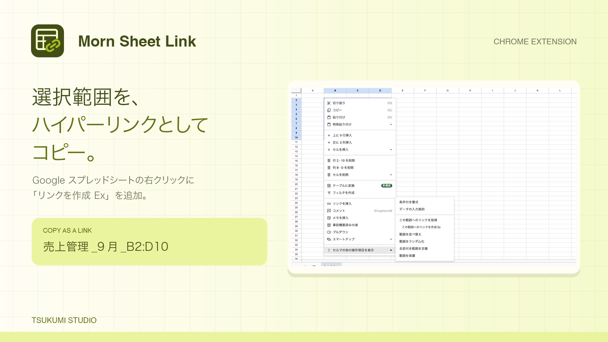

# Morn Sheet Link Extension

Google スプレッドシートの選択範囲を、名前付きのリンクとしてコピーするChrome拡張です。

## インストール・更新

1. `chrome://extensions` でデベロッパーモードを有効にします。
2. 「パッケージ化されていない拡張機能を読み込む」で、このフォルダを選びます。
3. スプレッドシートを再読み込みします。

更新時は拡張の更新ボタンを押し、シートも再読み込みしてください。Chrome・Arcなど、ブラウザごとに導入が必要です。
